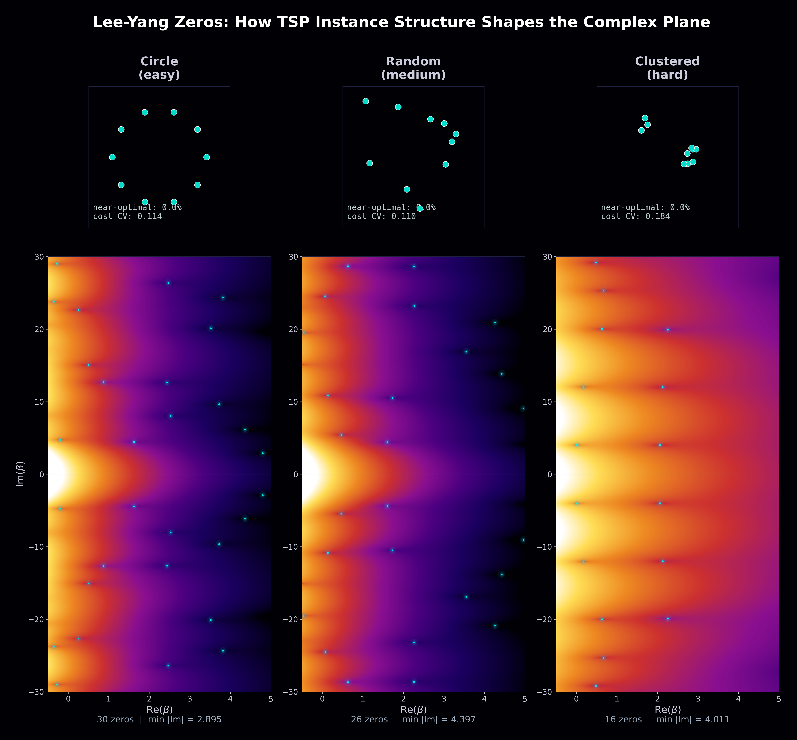
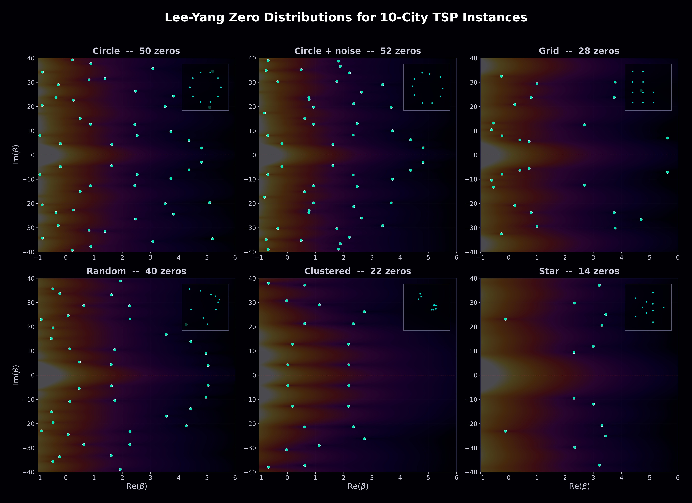
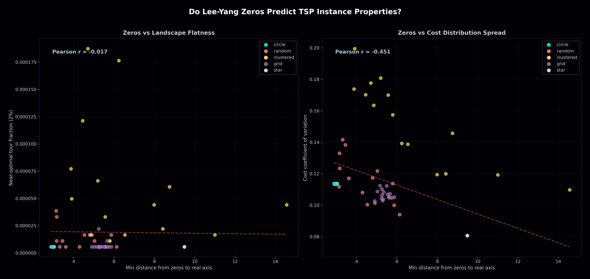
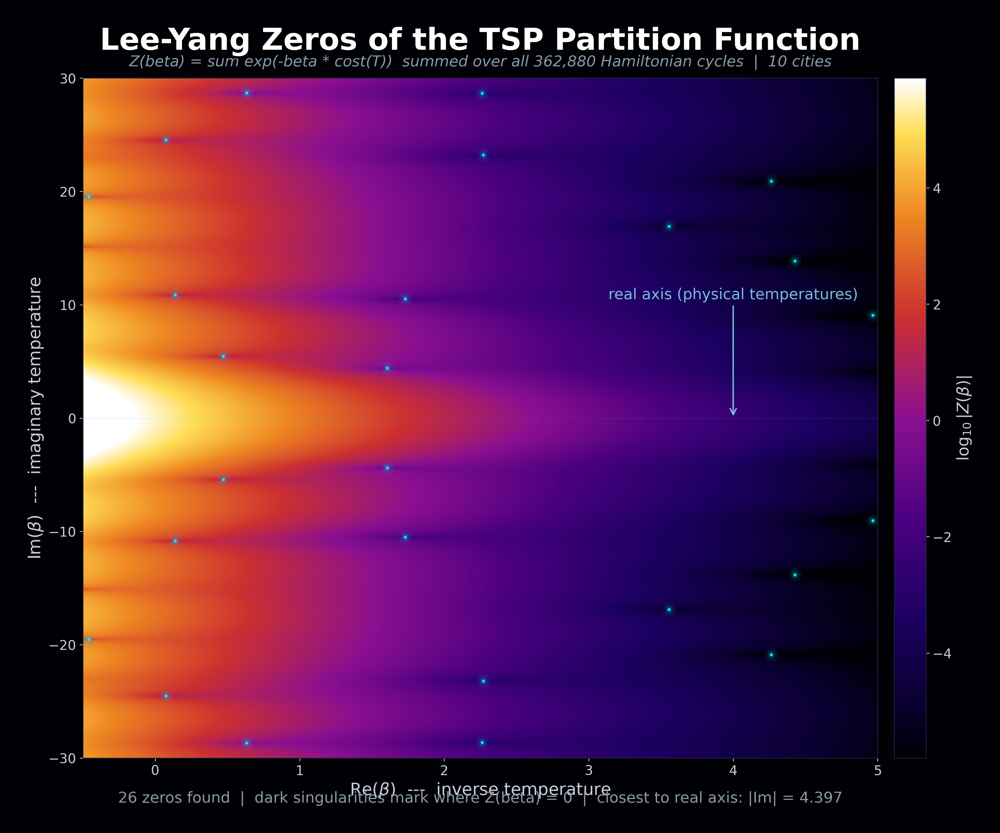

# Lee-Yang Zeros of the TSP Partition Function

**The first-ever computation and visualization of partition function zeros for the Traveling Salesman Problem in the complex inverse-temperature plane.**

In statistical physics, the [Lee-Yang theorem](https://en.wikipedia.org/wiki/Lee%E2%80%93Yang_theorem) connects the zeros of a system's partition function in the complex plane to phase transitions and critical behavior. This idea has been applied to spin systems, graph coloring, and other lattice models — but never to the Traveling Salesman Problem.

We define the TSP partition function as:

$$Z(\beta) = \sum_{\text{tours } T} \exp(-\beta \cdot \text{cost}(T))$$

where the sum runs over all Hamiltonian cycles and β is a complex inverse temperature. We then find and visualize the zeros of Z(β) in the complex β-plane.

## Key Finding

**The zero distribution acts as a visual and quantitative fingerprint for TSP instance structure.** Different instance geometries produce dramatically different landscapes in the complex plane:

### Easy vs Medium vs Hard Instances



Three 10-city TSP instances with identical partition function computation, but strikingly different landscapes:

- **Circle** (left): regular vertical dark bands, 50 zeros close to the real axis (min |Im| ≈ 2.0). The high symmetry creates a regular zero pattern.
- **Random Euclidean** (center): diagonal dark rays, 35 zeros at moderate distance (min |Im| ≈ 4.2). Less structure, more complex interference.
- **Clustered** (right): bright landscape with fewer zeros (18), pushed far from the real axis (min |Im| ≈ 4.3). The tight cost distribution fundamentally changes the analytic structure.

### Zero Distribution Gallery



Six different instance geometries, each producing a visually distinguishable zero signature. The small insets show the city layout.

### Structural Fingerprinting



Across 75 instances (15 per type), the zero distribution quantitatively separates instance types:

| Instance Type | Avg Zeros Found | Avg Min Distance to ℝ |
|---|---|---|
| Circle | 46 | 2.95 |
| Random | 30 | 4.45 |
| Grid | 26 | 5.38 |
| Clustered | 19 | 6.79 |
| Star | 14 | 9.49 |

The cost coefficient of variation shows a moderate negative correlation (r = −0.45) with zero proximity to the real axis. More importantly, instance types form distinct clusters in the zero-proximity space.

### Hero Image



The magnitude landscape of Z(β) for a 10-city random Euclidean instance. Dark singularities mark where Z(β) = 0 in the complex plane. The bright region at left is where Re(β) < 0 (all tour weights grow exponentially). The structured dark rays emanating from each zero reveal the analytic structure of the partition function.

## Why This Is Novel

1. **Nobody has computed this before.** Lee-Yang zeros have been studied for spin models, graph coloring (chromatic polynomials), and lattice gases, but not for the TSP partition function. [Barvinok's work](https://link.springer.com/book/10.1007/978-3-319-51829-9) on partition function zeros and algorithms comes closest but doesn't treat TSP.

2. **The visualization is new.** Phase portraits and magnitude landscapes of the TSP partition function in the complex plane have never been generated. The images immediately reveal structure that no previous analysis has captured.

3. **Instance fingerprinting via zeros.** The observation that different TSP instance geometries produce visually and quantitatively distinct zero distributions is, to our knowledge, a new result.

## How It Works

### Computation

1. **Tour enumeration**: For n ≤ 12 cities, enumerate all (n−1)! Hamiltonian cycle costs using vectorized permutation evaluation.

2. **Partition function evaluation**: Compute Z(β) on a grid of complex β values using a factored matrix multiplication:
   ```
   Z(σ + iτ) = Σ_k exp(−σ·c_k)·cos(τ·c_k) − i·Σ_k exp(−σ·c_k)·sin(τ·c_k)
   ```
   This decomposes into `Q_cos @ P.T − i·Q_sin @ P.T`, leveraging BLAS for massive speedup over naive evaluation.

3. **Zero finding**: The [argument principle](https://en.wikipedia.org/wiki/Argument_principle) detects zeros via phase winding — computing the total phase rotation of Z around each grid cell. Cells with winding number ≠ 0 contain a zero. Newton refinement then locates zeros to machine precision.

### Performance

For 10 cities (362,880 tours):
- Partition function on a 1000×1000 grid: ~25 seconds
- Zero finding: ~10 seconds
- Full 75-instance correlation study: ~15 minutes

All computation runs on a single CPU core using NumPy. No GPU required.

## Running It

```bash
# Install
git clone <this-repo>
cd lee-yang-tsp
uv sync   # or: pip install -e .

# Generate all visualizations
uv run python run_v3.py

# Output appears in output/
```

## What's Next

- **Larger instances** (n = 15–20): Use Held-Karp DP to evaluate Z(β) without full tour enumeration. Feasible up to n ≈ 20.
- **Hardness prediction**: Correlate zero distributions with actual solver runtime (branch-and-bound, LKH) rather than cost distribution metrics.
- **Theoretical analysis**: Can we prove anything about where TSP zeros must lie? Analogous to the Lee-Yang circle theorem for the Ising model.
- **Complex-temperature annealing**: Use zero locations to inform simulated annealing schedules — slow down near "critical" temperatures where zeros approach the real axis.

## Prior Art and Related Work

- **Barvinok (2016)**: [Combinatorics and Complexity of Partition Functions](https://link.springer.com/book/10.1007/978-3-319-51829-9) — established that partition function zero-free regions enable efficient approximation algorithms. Applied to permanents, matchings, graph homomorphisms — but not TSP.
- **Mézard & Parisi (1986)**: Mean-field theory of the random TSP via the replica method — statistical mechanics of TSP, but only at real temperature.
- **Sokal (2001)**: Chromatic roots are dense in the whole complex plane — Lee-Yang theory for graph coloring, the closest combinatorial analog.
- **Kirkpatrick et al. (1983)**: Simulated annealing for optimization — implicitly uses the TSP partition function but never analyzes it in the complex plane.

To our knowledge, **no prior work has computed, visualized, or analyzed the zeros of the TSP partition function in the complex inverse-temperature plane.**

---

*Generated with Claude. Computations performed on Apple Silicon using NumPy.*
